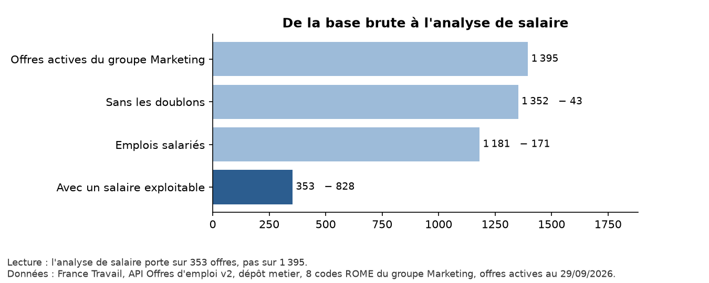
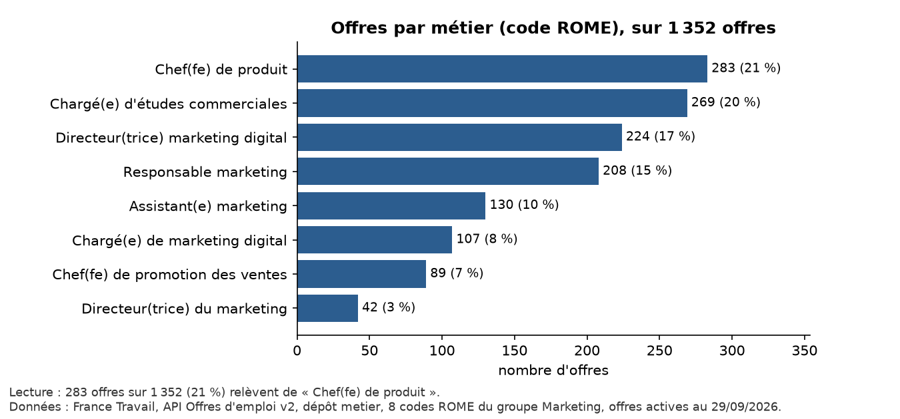
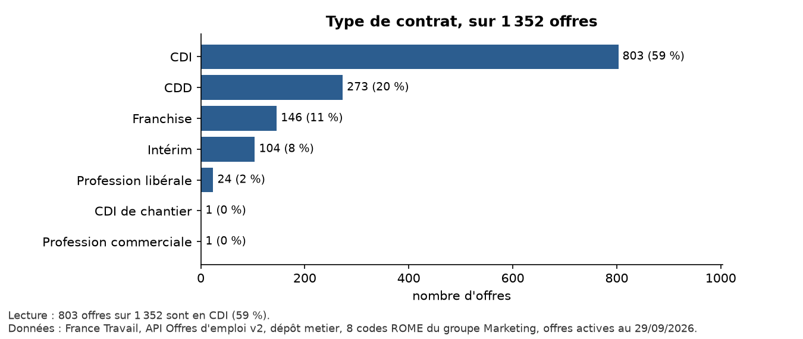
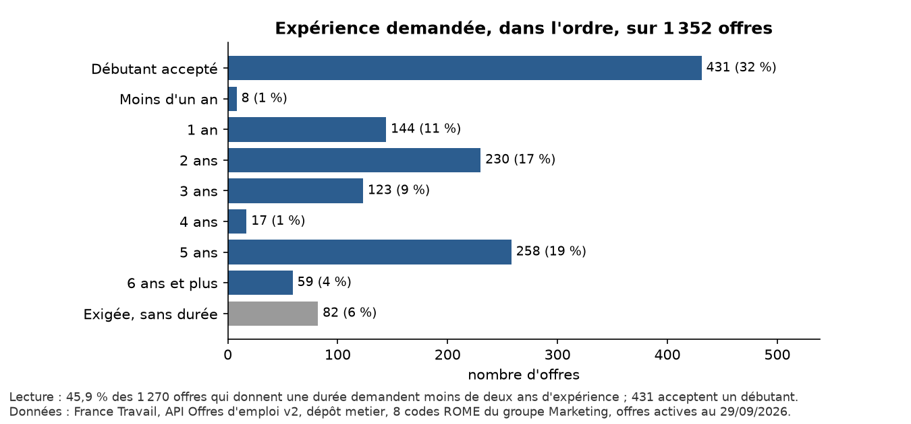
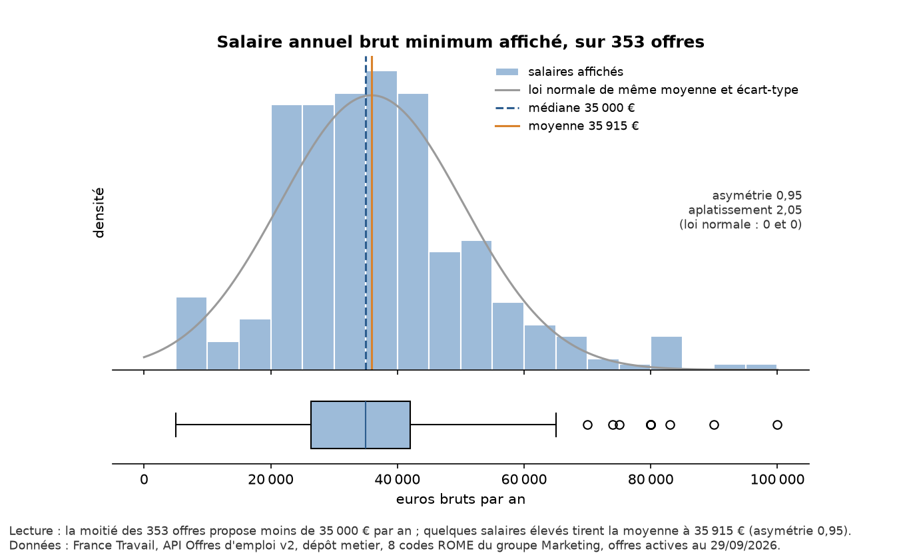
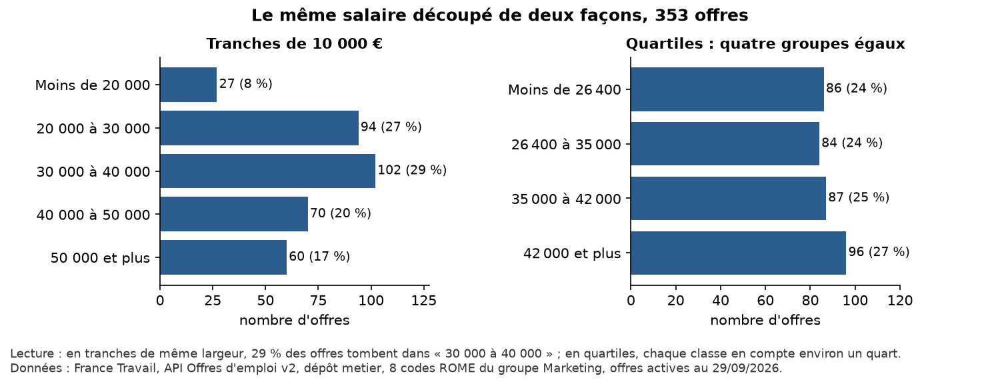
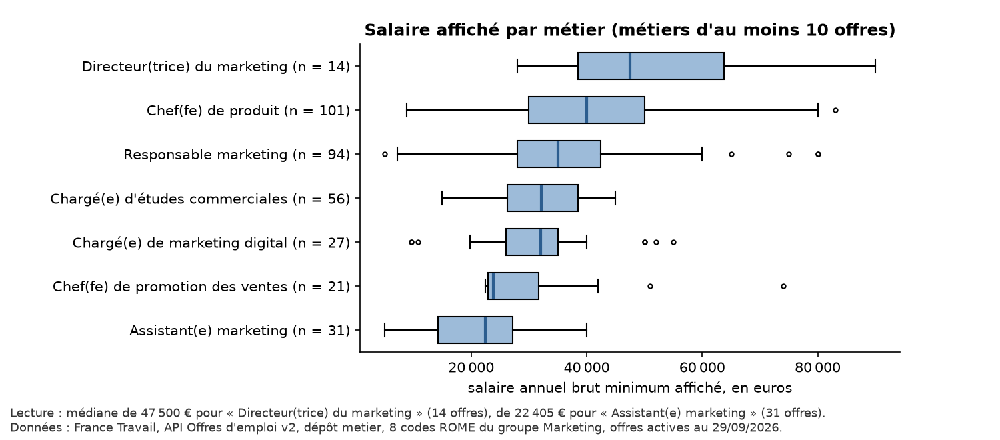
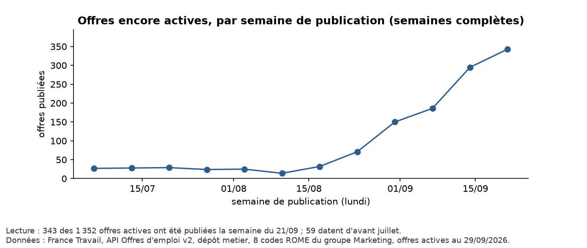
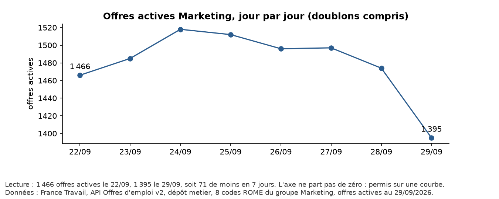
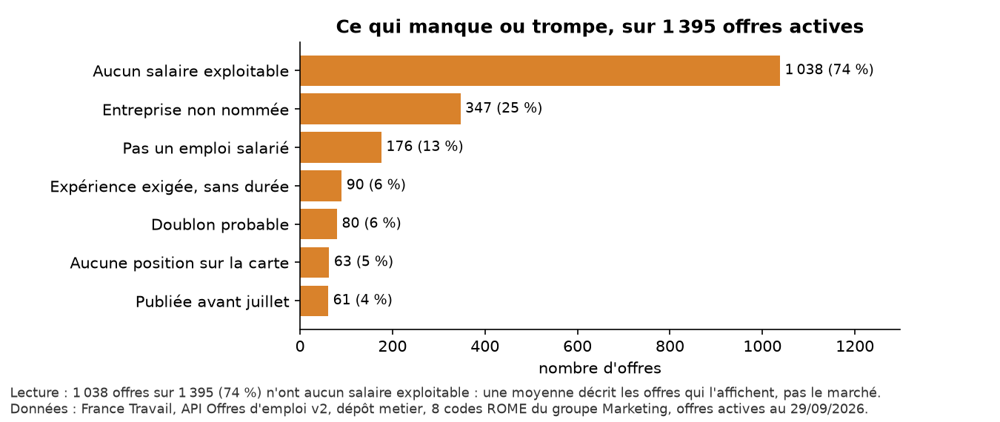

# TD 1 — Décrire et montrer : le marché des métiers du marketing

**Données** : France Travail — API Offres d'emploi v2 ; une requête codeROME par métier, France entière ; offres actives au **29/09/2026**.  
**Périmètre** : les 8 codes ROME du groupe Marketing du dépôt metier — M1718 Chargé(e) de marketing digital, M1716 Directeur(trice) marketing digital, M1705 Responsable marketing, M1703 Chef(fe) de produit, M1620 Assistant(e) marketing, M1706 Chef(fe) de promotion des ventes, M1430 Chargé(e) d'études commerciales, M1711 Directeur(trice) du marketing.  
**Refaire tous les chiffres** : `python td1/preparer.py` puis `python td1/decrire.py`.

> La base change chaque matin : chaque chiffre ci-dessous vaut pour le 29/09/2026, et il est donné avec son effectif.

## 1. Les variables et leur nature

La nature de la variable décide du résumé et du graphique autorisés.

| Variable | Nature | Résumé | Graphique | Remarque |
|---|---|---|---|---|
| metier / rome | qualitative nominale | effectifs, fréquences | barres | un code ROME ne se moyenne pas |
| contrat | qualitative nominale | effectifs, fréquences | barres |  |
| salarie, teletravail, doublon | qualitative nominale (binaire) | effectifs, fréquences | barres |  |
| departement | qualitative nominale | effectifs, fréquences | barres | écrit en chiffres, mais pas quantitatif |
| experience | qualitative ordinale | fréquences, % cumulé, médiane | barres dans l'ordre | recodée en classes d'années |
| formation | qualitative ordinale | fréquences, médiane | barres dans l'ordre | Bac < Bac+2 < Bac+3/4 < Bac+5 |
| salaire_min_annuel | quantitative continue | moyenne, médiane, écart-type, quartiles | histogramme, boîte à moustaches | ramené à l'année |
| date_publication | date | effectifs par semaine | courbe |  |
| id, url, intitule, entreprise | identifiants / texte | — | — | ne se résument pas tels quels |

## 2. La trace du nettoyage

Avant le premier graphique : combien de lignes au départ, ce qui est retiré, et pourquoi. Rien n'est effacé de `base_marketing.csv` : les lignes retirées sont marquées (colonnes `doublon`, `salarie`).

| Étape | Offres | Retirées | Pourquoi |
|---|---|---|---|
| Offres actives du groupe Marketing | 1 395 |  | 8 codes ROME, offres actives au 2026-09-29 |
| Sans les doublons | 1 352 | − 43 | même intitulé, même entreprise, même lieu : on garde la plus récente |
| Emplois salariés | 1 181 | − 171 | franchises, professions libérales et commerciales retirées |
| Avec un salaire exploitable | 353 | − 828 | aucun salaire affiché, ou montant hors de 4 000 à 250 000 € bruts par an (8 saisies invraisemblables) |

Doublons : 37 groupes d'annonces au même intitulé, même entreprise, même lieu, soit 80 offres (tailles de groupe : 2 exemplaires × 34, 3 exemplaires × 2, 6 exemplaires × 1). On compte des offres, pas des postes : dans chaque groupe, on garde la plus récente.

Recodages :

- **salaire** : le libellé texte arrive en trois unités (252 en annuel, 93 en mensuel, 20 en horaire) ; ramené en brut annuel (mensuel × 12, horaire × 1 607 heures), on garde le minimum de la fourchette ; hors de 4 000 à 250 000 € par an, la saisie est jugée fausse et écartée ;
- **expérience** : « 1 An(s) », « 6 Mois », « 24 Mois - Marketing direct »… recodés en classes d'années dans l'ordre ; « Expérience exigée » sans durée mise à part, en manquant.

*Lecture : l'analyse de salaire porte sur 353 offres, pas sur 1 395.*

## 3. Variables qualitatives : effectifs et fréquences

Périmètre : les 1 352 offres actives sans les doublons.

### Métier

*Lecture : 283 offres sur 1 352 (21 %) relèvent de « Chef(fe) de produit ».*

### Type de contrat

| Contrat | Effectif | Fréquence |
|---|---|---|
| CDI | 803 | 59,4 % |
| CDD | 273 | 20,2 % |
| Franchise | 146 | 10,8 % |
| Intérim | 104 | 7,7 % |
| Profession libérale | 24 | 1,8 % |
| CDI de chantier | 1 | 0,1 % |
| Profession commerciale | 1 | 0,1 % |
| **Total** | 1 352 | 100 % |

*Lecture : 803 offres sur 1 352 sont en CDI (59 %).*

### Expérience demandée (ordinale)

Le pourcentage se calcule sur toutes les offres ; le pourcentage valide, sur les seules 1 270 offres qui donnent une durée ; le cumulé additionne les classes dans l'ordre.

| Expérience | Effectif | Pourcentage | % valide | % cumulé |
|---|---|---|---|---|
| Débutant accepté | 431 | 31,9 % | 33,9 % | 33,9 % |
| Moins d'un an | 8 | 0,6 % | 0,6 % | 34,6 % |
| 1 an | 144 | 10,7 % | 11,3 % | 45,9 % |
| 2 ans | 230 | 17,0 % | 18,1 % | 64,0 % |
| 3 ans | 123 | 9,1 % | 9,7 % | 73,7 % |
| 4 ans | 17 | 1,3 % | 1,3 % | 75,0 % |
| 5 ans | 258 | 19,1 % | 20,3 % | 95,4 % |
| 6 ans et plus | 59 | 4,4 % | 4,6 % | 100,0 % |
| Exigée, sans durée | 82 | 6,1 % | manquant |  |
| **Total** | 1 352 | 100 % | 100 % |  |

Classe médiane : **2 ans** (l'offre du milieu, parmi celles qui donnent une durée).

*Lecture : 45,9 % des 1 270 offres qui donnent une durée demandent moins de deux ans d'expérience ; 431 acceptent un débutant.*

## 4. Variable quantitative : le salaire

Périmètre : les 353 emplois salariés, sans doublon, avec un salaire exploitable. Ce salaire décrit les offres qui l'affichent, pas le marché : 74 % des offres n'en affichent aucun.

| Indicateur | Valeur |
|---|---|
| Effectif | 353 |
| Moyenne | 35 915 € |
| Médiane | 35 000 € |
| Classe modale (tranches de 5 000) | 35 000 à 40 000 € |
| Écart-type | 14 470 € |
| Variance | 209 millions d'« euros au carré » |
| Minimum | 5 000 € |
| 1er quartile | 26 400 € |
| 3e quartile | 42 000 € |
| Maximum | 100 000 € |
| Étendue | 95 000 € |
| Écart interquartile | 15 600 € |
| Asymétrie (skewness) | 0,95 |
| Aplatissement (kurtosis, en excès) | 2,05 |

*Lecture : la moitié des 353 offres propose moins de 35 000 € par an ; quelques salaires élevés tirent la moyenne à 35 915 € (asymétrie 0,95).*

La distribution n'est pas normale : elle s'étire vers les hauts salaires (asymétrie 0,95 > 0), c'est pourquoi on lit la **médiane** plutôt que la moyenne. L'aplatissement est donné « en excès » : 0 pour une loi normale.

### Mettre le salaire en classes

Aucun découpage n'est neutre : des tranches de même largeur ou des classes de même effectif (quartiles). On garde toujours la variable d'origine.

| Tranches de 10 000 € | Offres |
|---|---|
| Moins de 20 000 | 27 |
| 20 000 à 30 000 | 94 |
| 30 000 à 40 000 | 102 |
| 40 000 à 50 000 | 70 |
| 50 000 et plus | 60 |

| Quartiles | Offres |
|---|---|
| Moins de 26 400 | 86 |
| 26 400 à 35 000 | 84 |
| 35 000 à 42 000 | 87 |
| 42 000 et plus | 96 |

*Lecture : en tranches de même largeur, 29 % des offres tombent dans « 30 000 à 40 000 » ; en quartiles, chaque classe en compte environ un quart.*

### Même métier, même dispersion ?

| Métier | Offres avec salaire | Médiane | Écart-type |
|---|---|---|---|
| Assistant(e) marketing | 31 | 22 405 € | 9 009 € |
| Chef(fe) de promotion des ventes | 21 | 23 800 € | 12 826 € |
| Chargé(e) de marketing digital | 27 | 32 000 € | 11 765 € |
| Chargé(e) d'études commerciales | 56 | 32 200 € | 7 098 € |
| Responsable marketing | 94 | 35 000 € | 14 225 € |
| Chef(fe) de produit | 101 | 40 000 € | 13 694 € |
| Directeur(trice) du marketing | 14 | 47 500 € | 17 791 € |

*Lecture : médiane de 47 500 € pour « Directeur(trice) du marketing » (14 offres), de 22 405 € pour « Assistant(e) marketing » (31 offres).*

## 5. Les dates

*Lecture : 343 des 1 352 offres actives ont été publiées la semaine du 21/09 ; 59 datent d'avant juillet.*

*Lecture : 1 466 offres actives le 22/09, 1 395 le 29/09, soit 71 de moins en 7 jours. L'axe ne part pas de zéro : permis sur une courbe.*

## 6. Le désordre de la base

Compté sur les 1 395 offres actives, doublons compris.

| Problème | Offres | Part |
|---|---|---|
| Aucun salaire exploitable | 1 038 | 74 % |
| Entreprise non nommée | 347 | 25 % |
| Pas un emploi salarié | 176 | 13 % |
| Expérience exigée, sans durée | 90 | 6 % |
| Doublon probable | 80 | 6 % |
| Aucune position sur la carte | 63 | 5 % |
| Publiée avant juillet | 61 | 4 % |

*Lecture : 1 038 offres sur 1 395 (74 %) n'ont aucun salaire exploitable : une moyenne décrit les offres qui l'affichent, pas le marché.*

Et la base ne voit que France Travail : les offres publiées seulement ailleurs (APEC, LinkedIn, sites des entreprises) n'y sont pas.
