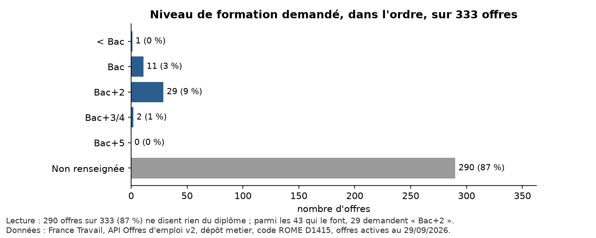
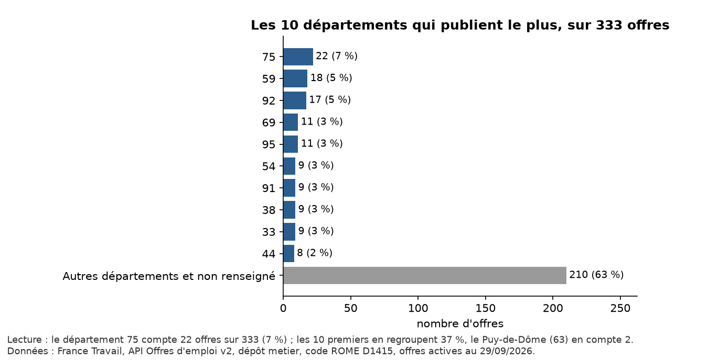

# TD 1 — Décrire et montrer : le marché du métier D1415 Chargé(e) de relation client (CRM)

**Données** : France Travail — API Offres d'emploi v2 ; une requête codeROME par métier, France entière ; offres actives au **29/09/2026**.  
**Périmètre** : D1415 Chargé(e) de relation client (CRM), France entière.  
**Refaire tous les chiffres** : `python td1/preparer.py` puis `python td1/decrire.py`.

> La base change chaque matin : chaque chiffre ci-dessous vaut pour le 29/09/2026, et il est donné avec son effectif.

## 1. Les variables et leur nature

La nature de la variable décide du résumé et du graphique autorisés.

| Variable | Nature | Résumé | Graphique | Remarque |
|---|---|---|---|---|
| metier / rome | qualitative nominale | effectifs, fréquences | barres | un code ROME ne se moyenne pas |
| contrat | qualitative nominale | effectifs, fréquences | barres |  |
| salarie, teletravail, doublon | qualitative nominale (binaire) | effectifs, fréquences | barres |  |
| departement | qualitative nominale | effectifs, fréquences | barres | écrit en chiffres, mais pas quantitatif |
| experience | qualitative ordinale | fréquences, % cumulé, médiane | barres dans l'ordre | recodée en classes d'années |
| formation | qualitative ordinale | fréquences, médiane | barres dans l'ordre | Bac < Bac+2 < Bac+3/4 < Bac+5 |
| salaire_min_annuel | quantitative continue | moyenne, médiane, écart-type, quartiles | histogramme, boîte à moustaches | ramené à l'année |
| date_publication | date | effectifs par semaine | courbe |  |
| id, url, intitule, entreprise | identifiants / texte | — | — | ne se résument pas tels quels |

## 2. La trace du nettoyage

Avant le premier graphique : combien de lignes au départ, ce qui est retiré, et pourquoi. Rien n'est effacé de `base.csv` : les lignes retirées sont marquées (colonnes `doublon`, `salarie`).

| Étape | Offres | Retirées | Pourquoi |
|---|---|---|---|
| Offres actives du périmètre | 350 |  | D1415, offres actives au 2026-09-29 |
| Sans les doublons | 333 | − 17 | même intitulé, même entreprise, même lieu : on garde la plus récente |
| Emplois salariés | 333 |  | franchises, professions libérales et commerciales retirées |
| Avec un salaire exploitable | 147 | − 186 | aucun salaire affiché, ou montant hors de 4 000 à 250 000 € bruts par an (25 saisies invraisemblables) |

Doublons : 13 groupes d'annonces au même intitulé, même entreprise, même lieu, soit 30 offres (tailles de groupe : 2 exemplaires × 10, 3 exemplaires × 2, 4 exemplaires × 1). On compte des offres, pas des postes : dans chaque groupe, on garde la plus récente.

Recodages :

- **salaire** : le libellé texte arrive en trois unités (67 en annuel, 95 en mensuel, 19 en horaire) ; ramené en brut annuel (mensuel × 12, horaire × 1 820 heures payées), on garde le minimum de la fourchette ; hors de 4 000 à 250 000 € par an, la saisie est jugée fausse et écartée (les plus fréquentes : « Annuel de 480.0 Euros à 1801.0 Euros » × 8; « Annuel de 486.0 Euros à 1801.0 Euros » × 7; « Annuel de 400.0 Euros » × 2; « Annuel de 487.0 Euros à 1807.0 Euros » × 2; « Mensuel de 25200.0 Euros à 27600.0 Euros » × 1) ;
- **expérience** : « 1 An(s) », « 6 Mois », « 24 Mois »… recodés en classes d'années dans l'ordre ; « Expérience exigée » sans durée mise à part, en manquant.

*Lecture : l'analyse de salaire porte sur 147 offres, pas sur 350.*

## 3. Variables qualitatives : effectifs et fréquences

Périmètre : les 333 offres actives sans les doublons.

### Niveau de formation demandé (ordinale)

| Formation | Effectif | Pourcentage | % valide |
|---|---|---|---|
| < Bac | 1 | 0,3 % | 2,3 % |
| Bac | 11 | 3,3 % | 25,6 % |
| Bac+2 | 29 | 8,7 % | 67,4 % |
| Bac+3/4 | 2 | 0,6 % | 4,7 % |
| Bac+5 | 0 | 0,0 % | 0,0 % |
| Non renseignée | 290 | 87,1 % | manquant |
| **Total** | 333 | 100 % | 100 % |

*Lecture : 290 offres sur 333 (87 %) ne disent rien du diplôme ; parmi les 43 qui le font, 29 demandent « Bac+2 ».*

### Département

Les offres viennent de 79 départements. Un numéro de département s'écrit en chiffres mais ne se moyenne pas : c'est une variable nominale.

*Lecture : le département 75 compte 22 offres sur 333 (7 %) ; les 10 premiers en regroupent 37 %, le Puy-de-Dôme (63) en compte 2.*

### Type de contrat

| Contrat | Effectif | Fréquence |
|---|---|---|
| CDI | 155 | 46,5 % |
| CDD | 117 | 35,1 % |
| Intérim | 60 | 18,0 % |
| Saisonnier | 1 | 0,3 % |
| **Total** | 333 | 100 % |

*Lecture : 155 offres sur 333 sont en CDI (47 %).*

### Expérience demandée (ordinale)

Le pourcentage se calcule sur toutes les offres ; le pourcentage valide, sur les seules 300 offres qui donnent une durée ; le cumulé additionne les classes dans l'ordre.

| Expérience | Effectif | Pourcentage | % valide | % cumulé |
|---|---|---|---|---|
| Débutant accepté | 181 | 54,4 % | 60,3 % | 60,3 % |
| Moins d'un an | 10 | 3,0 % | 3,3 % | 63,7 % |
| 1 an | 34 | 10,2 % | 11,3 % | 75,0 % |
| 2 ans | 44 | 13,2 % | 14,7 % | 89,7 % |
| 3 ans | 22 | 6,6 % | 7,3 % | 97,0 % |
| 4 ans | 0 | 0,0 % | 0,0 % | 97,0 % |
| 5 ans | 8 | 2,4 % | 2,7 % | 99,7 % |
| 6 ans et plus | 1 | 0,3 % | 0,3 % | 100,0 % |
| Exigée, sans durée | 33 | 9,9 % | manquant |  |
| **Total** | 333 | 100 % | 100 % |  |

Classe médiane : **Débutant accepté** (l'offre du milieu, parmi celles qui donnent une durée).

*Lecture : 75,0 % des 300 offres qui donnent une durée demandent moins de deux ans d'expérience ; 181 acceptent un débutant.*

## 4. Variable quantitative : le salaire

Périmètre : les 147 emplois salariés, sans doublon, avec un salaire exploitable. Ce salaire décrit les offres qui l'affichent, pas le marché : 57 % des offres n'en affichent aucun.

| Indicateur | Valeur |
|---|---|
| Effectif | 147 |
| Moyenne | 23 276 € |
| Médiane | 24 006 € |
| Classe modale (tranches de 5 000) | 20 000 à 25 000 € |
| Écart-type | 7 322 € |
| Variance | 54 millions d'« euros au carré » |
| Minimum | 4 800 € |
| 1er quartile | 22 404 € |
| 3e quartile | 27 000 € |
| Maximum | 45 000 € |
| Étendue | 40 200 € |
| Écart interquartile | 4 596 € |
| Asymétrie (skewness) | -0,88 |
| Aplatissement (kurtosis, en excès) | 1,81 |

*Lecture : la moitié des 147 offres propose moins de 24 006 € par an ; la moyenne, 23 276 €, est tirée vers le bas par les valeurs extrêmes (asymétrie -0,88).*

Asymétrie -0,88 : la distribution s'étire vers les bas salaires ; aplatissement 1,81, donné « en excès » (0 pour une loi normale). Quand la distribution n'est pas symétrique, on lit la **médiane** plutôt que la moyenne.

### Mettre le salaire en classes

Aucun découpage n'est neutre : des tranches de même largeur ou des classes de même effectif (quartiles). On garde toujours la variable d'origine.

| Tranches de 10 000 € | Offres |
|---|---|
| Moins de 20 000 | 17 |
| 20 000 à 30 000 | 111 |
| 30 000 à 40 000 | 16 |
| 40 000 à 50 000 | 3 |
| 50 000 et plus | 0 |

| Quartiles | Offres |
|---|---|
| Moins de 22 404 | 28 |
| 22 404 à 24 006 | 45 |
| 24 006 à 27 000 | 36 |
| 27 000 et plus | 38 |

*Lecture : en tranches de même largeur, 76 % des offres tombent dans « 20 000 à 30 000 » ; en quartiles, les classes vont de 28 à 45 offres : les salaires égaux à une borne les déséquilibrent.*

## 5. Les dates

*Lecture : 75 des 333 offres actives ont été publiées la semaine du 21/09 ; 6 datent d'avant juillet.*

*Lecture : 348 offres actives le 22/09, 350 le 29/09, soit 2 de plus en 7 jours. L'axe ne part pas de zéro : permis sur une courbe.*

## 6. Le désordre de la base

Compté sur les 350 offres actives, doublons compris.

| Problème | Offres | Part |
|---|---|---|
| Aucun salaire exploitable | 199 | 57 % |
| Entreprise non nommée | 120 | 34 % |
| Expérience exigée, sans durée | 35 | 10 % |
| Doublon probable | 30 | 9 % |
| Aucune position sur la carte | 7 | 2 % |
| Publiée avant juillet | 6 | 2 % |
| Pas un emploi salarié | 0 | 0 % |

*Lecture : 199 offres sur 350 (57 %) n'ont aucun salaire exploitable : une moyenne décrit les offres qui l'affichent, pas le marché.*

Et la base ne voit que France Travail : les offres publiées seulement ailleurs (APEC, LinkedIn, sites des entreprises) n'y sont pas.
